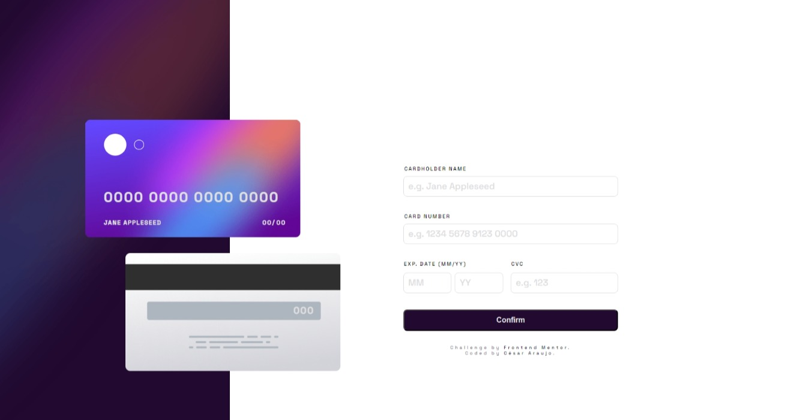
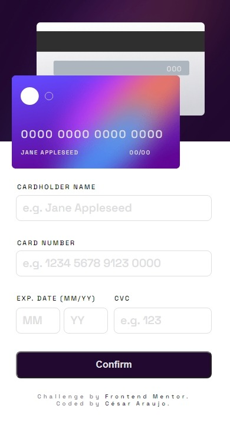

# Frontend Mentor - Interactive card details form solution

This is a solution to the [Interactive card details form challenge on Frontend Mentor](https://www.frontendmentor.io/challenges/interactive-card-details-form-XpS8cKZDWw). Frontend Mentor challenges help you improve your coding skills by building realistic projects.

## Table of contents

- [Frontend Mentor - Interactive card details form solution](#frontend-mentor---interactive-card-details-form-solution)
  - [Table of contents](#table-of-contents)
  - [Overview](#overview)
    - [The challenge](#the-challenge)
    - [Screenshots](#screenshots)
  - [Website live](#website-live)
  - [My process](#my-process)
    - [Built with](#built-with)
  - [Author](#author)

## Overview

### The challenge

Users should be able to:

- Fill in the form and see the card details update in real-time
- Receive error messages when the form is submitted if:
  - Any input field is empty
  - The card number, expiry date, or CVC fields are in the wrong format
- View the optimal layout depending on their device's screen size
- See hover, active, and focus states for interactive elements on the page

### Screenshots

Desktop version

Mobile version

## [Website live](https://project-form-validation-frontend.vercel.app/)

## My process

In this project I put into practice my knowledge in semantic HTML5. In addition, I used SCSS to add styles to the website.
The interaction of the website is implemented with JavaScript. Here, DOM manipulation was key for the form validation logic, as well as the use of regex for the validations of each field.
The website is built with a mobile first approach. Thanks to this workflow, the project was built more efficiently.

### Built with

- Semantic HTML5 markup
- SCSS custom properties
- Flexbox
- Mobile-first workflow
- JavaScript
  - Dom Manipulation

## Author

- Frontend Mentor - [@araujocesarr](https://www.frontendmentor.io/profile/araujocesarr)
- Email - [cesararaujo.perez@gmail.com](mailto:cesararaujo.perez@gmail.com)
